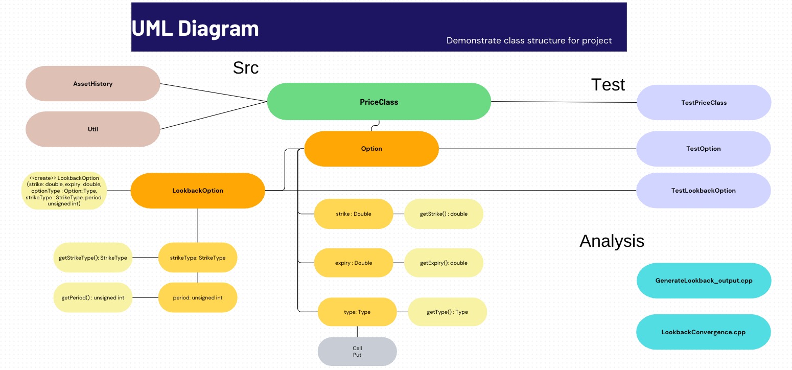

# IB9JHO - Programming for Quantitative Finance - Group Project (C++)

***

## Introduction
 Lookback options derive their value from the extreme asset prices observed during the option's lifetime—a characteristic that precludes standard closed-form pricing methods. Our approach leverages a rigorous mathematical framework based on geometric Brownian motion to model asset dynamics and derives the corresponding payoff structures for both fixed and floating strike options. In addition, we implement multiple variance reduction techniques to enhance the accuracy and efficiency of our simulations.

***

## Project Overview

This project is structured to ensure modularity, extensibility, and maintainability:
- **Option and LookbackOption Classes:** Define the base and specialised option types. The `LookbackOption` class implements payoff functions that capture the path dependency by tracking extreme asset prices.
- **PriceClass:** Encapsulates the Monte Carlo simulation methods (naïve, antithetic variates, control variates, and stratified sampling) to compute option prices.
- **AssetHistory and Util Modules:** Support functions for generating and processing asset price histories and auxiliary operations.
- **Testing:** A comprehensive suite of unit tests (using Catch2) ensures that each component functions as expected.
- **Analysis Module:** Generates CSV outputs for further analysis and visualization.

***

## Instructions to Run the Project

### Prerequisites
- A C++ compiler
- CMake version 3.14 or later

###  Project Structure

- **`CMakeLists.txt`**: Top-level build configuration.
- **`main.cpp`**: Entry point for the main application.
- **`Option.h` / `Option.cpp`**: Defines an abstract base class for options.
- **`LookbackOption.h` / `LookbackOption.cpp`**: Implements path-dependent logic for lookback options.
- **`PriceClass.h` / `PriceClass.cpp`**: Houses various Monte Carlo pricing methods.
- **`GenerateLookback_output.cpp` / `LookbackConvergence.cpp`**: Contains code for outputting CSV files used in further analysis.
- **`AssetHistory.cpp` / `AssetHistory.h`**: Simualtion of a market e.g path of underlying stocks using GBM
- **`Util.cpp` / `Util.h`**: Contains helper functions for mathematical operations
- **`tests/`**: Contains Catch2-based unit tests.


### Building the Project

Below is a step-by-step guide for building the project via the command line. If you are using Visual Studio Code with the CMake Tools extension, you can adapt these steps accordingly.

1. **Clone or Download** the repository to your local machine.

2. **Open a Terminal** in the project’s root directory (where the main `CMakeLists.txt` file is located).

3. **Create a Build Directory** and navigate into it:
   ```
   mkdir build
   cd build
   ```

4. **Generater Build Files with CMake** 
    ```
    cmake ..
    ```

5. **Compile the Project**
    ```
    cmake --build
    ```

### Running the Main Application

1. **Navigate to the Main Application's Build Folder**
    ```
    cd build
    ```

2. **Run the Executable**
On Mac:
    ```
    ./generate_lookback_output
    ```

On Windows:
    \`\`\`bash
    generate_lookback_output.exe
    \`\`\`


### Running the Tests

1. **Navigate to the Tests Build Folder**
    ```
    cd build/tests
    ```
2. **Run the Executable**
On Mac:
    ```
    ./TestOption
    ./TestLookbackOption
    ./TestPriceClass
    ```

On Windows:

\`\`\`bash
TestOption.exe
TestLookbackOption.exe
TestPriceClass.exe
\`\`\`

***

## Implementation

The UML below briefly outlines the design of our codebase.



`Option.hpp` and `Option.cpp` define a base class called `Option`, representing a generic financial option. This class includes a constructor for initialising key parameters such as the strike price, expiry, and option type (call or put). It also declares a pure virtual function, `payoff()`, which computes the option's payoff at maturity. Additionally, the class provides accessor methods to retrieve the strike, expiry, and option type.

`LookbackOption.hpp` and `LookbackOption.cpp` define a derived class called `LookbackOption`, which inherits from the `Option` base class. A lookback option’s payoff depends on the extreme (maximum or minimum) asset prices observed during its lifetime. The constructor sets specific parameters such as the number of monitoring periods and whether the option has a fixed or floating strike. The `payoff()` function is overridden to account for these path-dependent features, and the class includes accessors to retrieve the strike type and the number of monitoring periods.

`PriceClass.hpp` and `PriceClass.cpp` define a `PriceClass` that employs numerical methods—specifically, Monte Carlo simulation—to price options. Its constructor initializes parameters such as the number of simulations, the spot price, the risk-free rate, volatility, and time to maturity. The core methods within this class (e.g., `calculateP_Naive`, `calculateP_Antithetic`, `calculateP_ControlVariates`, and `calculateP_StratifiedSampling`) rely on the option’s `payoff()` function to compute the payoff for each simulated path.

`main.cpp` serves as the driver program. It instantiates a `LookbackOption` with the desired parameters, passes it to the `PriceClass` instance to calculate the option price, and outputs the resulting prices to the console.

The entire codebase adheres to object-oriented programming best practices—encapsulation, inheritance, and polymorphism. It is well-documented and follows clear coding standards, ensuring the project is both maintainable and extensible.


